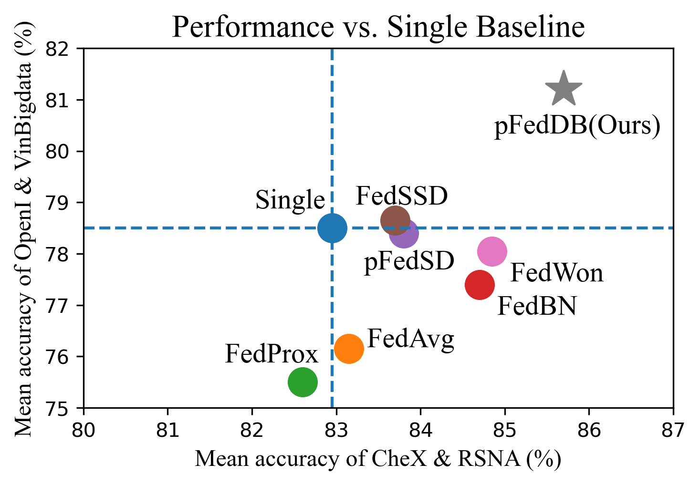
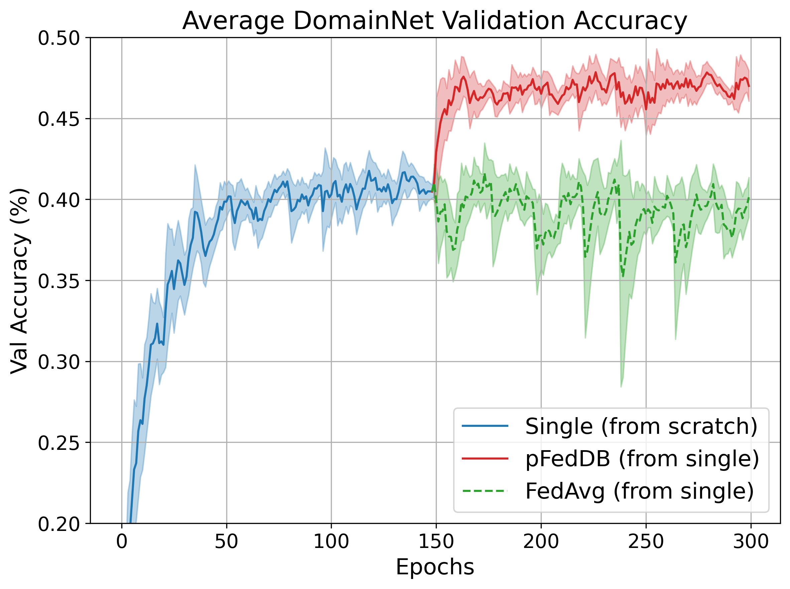

# Decoupling Shared and Personalized Knowledge: A Dual-Branch Federated Learning Framework for Multi-Domain with Non-IID Data
This is the PyTorch implemention of AAAI-26 paper **Decoupling Shared and Personalized Knowledge: A Dual-Branch Federated Learning Framework for Multi-Domain with Non-IID Data** by Yiran Pang, Zhen Ni, and Xiangnan Zhong.

📄 [Appendix](assets/Appendix.pdf)

## Abstract
Federated learning (FL) enables collaborative model training without centralizing data. In multi-domain scenarios with non-identically and independently distributed (non-IID) data, prediction performance is often hindered by catastrophic forgetting of specialized local knowledge and negative transfer from conflicting client updates.
To address these challenges, we propose a personalized FL framework with dual-branch (pFedDB) structure and a two-phase training protocol.
The dual-branch architecture separates the model into a shared branch for cross-client aggregation and a private branch that remains on each local client. The private branch is never overwritten by server updates, which prevents the catastrophic forgetting of domain-specific knowledge. This structure also significantly reduces communication overhead per round as only the shared branch is transmitted.
To mitigate negative transfer, our two-phase protocol first establishes a personalized knowledge anchor by training a single-branch expert model on each client's local data. In the second phase, the locally trained model is cloned to initialize private and shared branches. Only the shared branch is aggregated in federated training. This process enables the shared branch to learn a general representation that complements the established local expertise. This design consistently improves the performance of every client over its single-domain baseline, overcoming the challenge of negative transfer among clients.
Experiments on our new Chest-X-Ray-4 suite and three public benchmarks show that the proposed pFedDB method obtains 30\% saving in communication overhead per round and competitive or better accuracy performance than recent FL methods. 

<div align="center">
  
  
</div>

## Usage
### Setup
**uv (NVIDIA GPU / NV)**

Install uv: https://docs.astral.sh/uv/

```bash
# Linux/macOS
curl -LsSf https://astral.sh/uv/install.sh | sh

# Windows (PowerShell)
powershell -ExecutionPolicy ByPass -c "irm https://astral.sh/uv/install.ps1 | iex"
```

```bash
# Create a local virtualenv (recommended)
uv venv -p 3.12
source .venv/bin/activate

# Install PyTorch CUDA wheels
uv pip install -r requirements-uv-cu121.txt
```

Notes:
- If your driver/toolkit is older, switch to a different wheel index (e.g. `cu118`) and adjust the extra index URL in `requirements-uv-cu121.txt`.
- If `import torchvision` fails with missing system libs on Linux, install `libgl1` (and sometimes `libglib2.0-0`).

### Dataset
**Benchmark(Digits)**
- Please download pre-processed datasets [here](https://huggingface.co/datasets/Jemary/FedBN_Dataset/blob/main/digit_dataset.zip), put under `data/` directory and perform following commands:
    ```bash
    cd ./data
    unzip digit_dataset.zip
    ```

**Benchmark(Chest-X-Ray-4)**
- Please download pre-processed datasets [here](https://huggingface.co/datasets/ODDS2022/Chest-X-Ray-4/blob/main/Chest-X-Ray-4.zip), put under `data/` directory and perform following commands:
    ```bash
    cd ./data
    unzip Chest-X-Ray-4.zip
    ```
    
### Train
Federated Learning

Please using following commands to train a model with federated learning strategy.
```bash
cd federated
# benchmark experiment
uv run python fed_digits_twophase.py
```

### Evaluate
To evaluate the trained model, please using following commands:
```bash
# Digits
uv run python scripts/verify_digits_twophase.py --ckpt checkpoint/digits/twophase_digits/twophase_final.pt

# Chest-X-Ray-4 (OVCR)
uv run python scripts/verify_chex_twophase.py --ckpt checkpoint/chex/twophase_chex/twophase_chex_final --data-root /home/ypang1/expanse/pFedDB/data --batch 256
```

## TODO
Code release is ongoing. The following items will be updated soon:
- [ ] Release pre-processed Chest-X-Ray-4 dataset
- [ ] Add experiment code
- [ ] Add paper and poster link

## Acknowledgements
We acknowledge the open-source implementations of [FedBN](https://github.com/med-air/FedBN) and [pFedDR](https://github.com/CSU-YL/pFedDR), which provided a foundation for our development.
